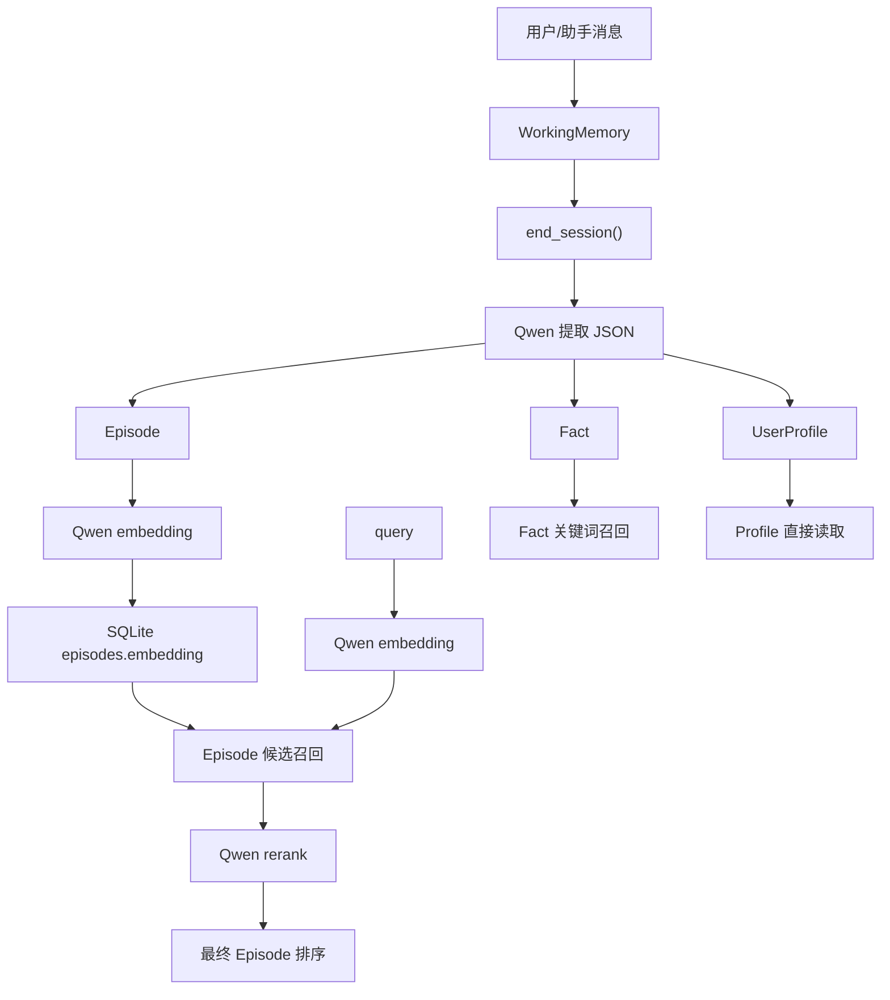

# toy-memory-system

面向儿童智能对话玩具的轻量记忆系统，采用三层记忆架构：

- `WorkingMemory`：保存当前会话的原始消息窗口
- `Episode`：把一段对话压缩成摘要型情景记忆
- `Fact` / `UserProfile`：保存长期事实和用户画像

当前默认方案以 Qwen 为主，但已经恢复为可配置 provider：

- `llm_provider` 可配置为 `qwen` 或 `deepseek`
- `Episode` 检索默认使用 Qwen 的 `embedding + rerank`
- `Fact` 检索继续使用关键词/结构化匹配
- 不再保留 `RuleBasedExtractor` 和项目内 `mock provider`

## 架构概览



## 检索策略

- `Episode`
  - 有 `query` 时：先生成 query embedding，再对候选 `Episode` 做余弦相似度召回，随后用 Qwen rerank 重排，最后叠加 `importance` 和 `recency`
  - 无 `query` 时：直接返回高重要性的最近 `Episode`
- `Fact`
  - 按 `subject / predicate / object` 做 SQL 模糊匹配
- `UserProfile`
  - 直接按 `user_id` 读取

这样分层的目的，是把“过去发生过什么”和“用户有哪些稳定事实”拆开处理。

## 环境要求

- Python `3.9+`
- `uv`
- Qwen API Key

推荐使用项目内现有的 `.venv`。

## 安装

```bash
uv pip install --python .\.venv\Scripts\python.exe -e .
uv pip install --python .\.venv\Scripts\python.exe pytest pytest-asyncio httpx pydantic fastapi uvicorn
```

## 配置

现在推荐只改一个文件：

- 主配置文件：[memory_settings.json](/E:/chr_git/memchr/memory_settings.json)
- 模板文件：[memory_settings.example.json](/E:/chr_git/memchr/memory_settings.example.json)

代码会在 [config.py](/E:/chr_git/memchr/config.py) 启动时自动读取这个文件。也就是说，平时不需要去改代码文件里的常量了。

最常改的项目都已经集中进去：

- `llm_provider`
- `embedding_provider`
- `rerank_provider`
- `llm_model`
- `embedding_model`
- `rerank_model`
- `conversation_turns_before_extraction`
- `working_memory_size`
- `max_context_episodes`
- `max_context_facts`
- `provider_api_keys`

示例：

```json
{
  "llm_provider": "qwen",
  "embedding_provider": "qwen",
  "rerank_provider": "qwen",
  "conversation_turns_before_extraction": 5,
  "provider_api_keys": {
    "qwen": "your-qwen-api-key",
    "deepseek": "your-deepseek-api-key"
  }
}
```

如果你想把“抽取记忆的时机”调快或调慢，改这个就可以：

```json
{
  "conversation_turns_before_extraction": 3
}
```

它表示：
- 用户和助手来回 3 轮后
- 在 `end_session()` 时触发一次长期记忆抽取

补充说明：
- `.env` 仍然支持，但现在更建议优先改 `memory_settings.json`
- [memory_settings.json](/E:/chr_git/memchr/memory_settings.json) 已加入 [.gitignore](/E:/chr_git/memchr/.gitignore)，因为里面可能包含真实 key
- 如果缺少对应 provider 的 API Key，`MemoryManager` 初始化会直接报错

## 快速使用

```python
import asyncio

from config import ConfigPresets
from memory_core.manager import MemoryManager


async def main():
    config = ConfigPresets.full_featured()
    manager = MemoryManager(config)

    session = manager.start_session("child_001")
    manager.add_message(session.session_id, "user", "我叫小明，我最喜欢恐龙。")
    manager.add_message(session.session_id, "assistant", "太好了，你喜欢哪种恐龙？")
    manager.add_message(session.session_id, "user", "我喜欢霸王龙。")
    manager.add_message(session.session_id, "assistant", "霸王龙真的很酷。")

    episode = await manager.end_session(session.session_id, extract_memory=True)
    print(episode.summary if episode else "no episode")


asyncio.run(main())
```

检索示例：

```python
context = await manager.get_memory_context(session_id, "我最喜欢什么恐龙")
print(context.to_system_prompt())
```

## API

启动服务：

```bash
python -m uvicorn api.server:app --reload --port 8000
```

主要接口：

- `POST /session/start`
- `POST /session/message`
- `POST /session/end`
- `POST /context`
- `GET /profile/{user_id}`
- `PUT /profile`
- `GET /stats/{user_id}`
- `GET /export/{user_id}`
- `POST /import`

## 测试

运行：

```bash
pytest tests/test_memory.py -q
```

配置自检：

```bash
python tests/self_check.py
```

一键体验：

```bash
python run_demo.py
```

当前测试覆盖：

- `QwenClient.extract_json()` / `embed_texts()` / `rerank()` 的响应解析
- `Episode.embedding` 的存取
- `end_session()` 生成 `Episode` / `Fact` / `UserProfile`
- `get_memory_context(query=...)` 的 `Episode` 语义召回
- `Fact` 关键词召回
- `Fact` 自然语言查询扩展召回
- 单文件配置 `memory_settings.json` 的读取与关键字段校验
- 缺少 API Key 时初始化报错
- Qwen 异常时不降级

## 关键文件

- [config.py](/E:/chr_git/memchr/config.py)
- [memory_core/models.py](/E:/chr_git/memchr/memory_core/models.py)
- [memory_core/manager.py](/E:/chr_git/memchr/memory_core/manager.py)
- [memory_core/extractor.py](/E:/chr_git/memchr/memory_core/extractor.py)
- [memory_core/llm_client.py](/E:/chr_git/memchr/memory_core/llm_client.py)
- [storage/sqlite_storage.py](/E:/chr_git/memchr/storage/sqlite_storage.py)
- [api/server.py](/E:/chr_git/memchr/api/server.py)
- [tests/test_memory.py](/E:/chr_git/memchr/tests/test_memory.py)
